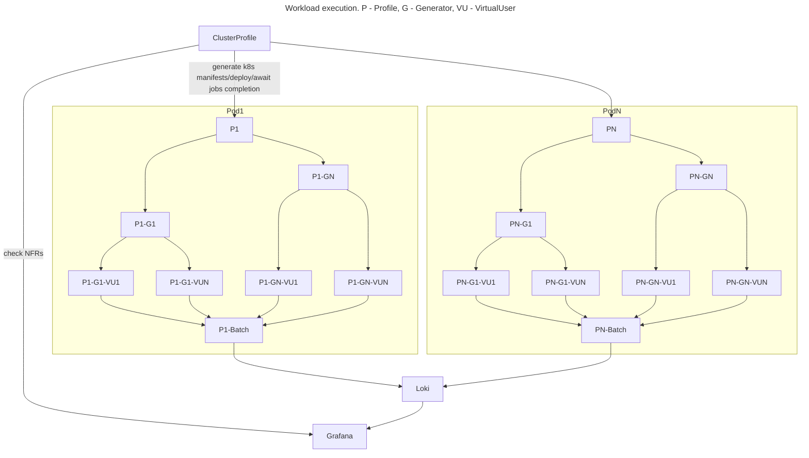

# Cluster mode

How it works:
- You separate your code into 2 parts: `cluster_test.go` ( client ) and `node_*_test.go` ( test )
- `cluster_test.go` only controls the deployment and tracks `k8s jobs`
- You can share your `cluster_test.go` for a group of tests and use env vars to set `test.name` or other settings
- Run client code, if `k8s` will fail to allocate resources test will end in `Timeout` and jobs will be deleted with pods
- When each `job` got allocated your pod code will start to wait until all `pods` spun by client ( with unique `sync` id generated on start ) will have status `Running` if that won't happen until timeout client will remove all the pods
- When `N pods with unique test label are in status Running` the test will start, lag between pods start is 1sec max
- In case of any fatal error client will remove all the `jobs`
- When all `jobs` are complete test will end

Workflow is:
- Create namespace `wasp` and apply default permissions
```
cd charts/wasp
kubectl create ns wasp
kubectl -n wasp apply -f setup.yaml
```
- Build your `Docker` container with tests, you can use this [example](Dockerfile.test)
```
docker build -f Dockerfile.test --build-arg BUILD_ROOT=/go/src/examples/cluster -t wasp_test .
docker tag wasp_test:latest ${registry}/wasp_test:latest
docker push ${registry}/wasp_test:latest
```

- Set [wasp chart](charts/wasp) in test params
```
ChartPath: "../../charts/wasp"
or 
ChartPath: "oci://public.ecr.aws/chainlink/wasp"
```
- Set `HelmValues` test params
```
			"env.loki.url":       os.Getenv("LOKI_URL"),
			"env.loki.token":     os.Getenv("LOKI_TOKEN"),
			"test.name":          "TestNodeRPS",
			"test.timeout":       "24h",
			"image":              "public.ecr.aws/chainlink/wasp-test:latest",
			"jobs":               "40",
			"resources.requests.cpu":    "2000m",
			"resources.requests.memory": "512Mi",
			"resources.limits.cpu":      "2000m",
			"resources.limits.memory":   "512Mi",
			"env.wasp.log_level": "debug",
```
- If you need to share some static data, you can use `go:embed` as described [here](http://www.inanzzz.com/index.php/post/1rwm/including-and-reading-static-files-with-embed-directive-at-compile-time-in-golang)
- Each test `pod` have some cluster env vars set on start:
```
LOKI_URL
LOKI_TOKEN
WASP_LOG_LEVEL - wasp log level
WASP_NODE_ID - pod unique ID (int, 1.."jobs")
WASP_NAMESPACE - namespace for wasp jobs
WASP_SYNC - label of a test group, used to select pods for a start check
WASP_JOBS - amount of jobs in test group
```

[Code](examples/cluster) examples

Example cluster component diagram:
