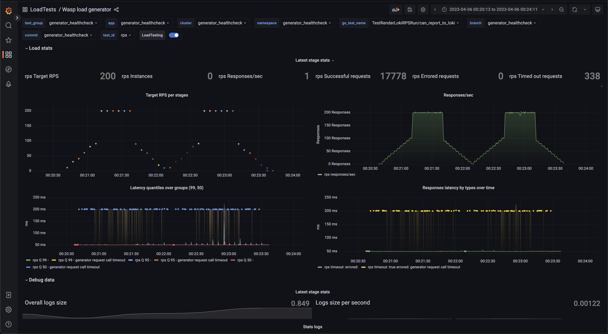

<p align="center">
     
</p>

<div align="center">


[](https://goreportcard.com/report/github.com/smartcontractkit/wasp)
[](https://github.com/smartcontractkit/wasp/actions/workflows/test.yml)
[](https://github.com/smartcontractkit/wasp/actions/workflows/bench.yml)
<a href='https://github.com/jpoles1/gopherbadger' target='_blank'></a>

Protocol-agnostic load testing library for `Go`

</div>

## Goals
- Easy to reuse any custom client `Go` code
- Easy to grasp
- Have slim codebase (500-1k loc)
- Have predictable performance footprint when tested with protocol mocks
- Easy to create synthetic or user-based scenarios
- Scalable in `k8s` without complicated configuration or vendored UI interfaces
- Non-opinionated reporting, push any data to `Loki`

## Setup
We are using `nix` for deps, see [installation](https://nixos.org/manual/nix/stable/installation/installation.html) guide
```bash
nix develop
```

## Run example tests with Grafana + Loki
```bash
make start
```
Insert `GRAFANA_TOKEN` created in previous command
```bash
export LOKI_URL=http://localhost:3030/loki/api/v1/push
export GRAFANA_URL=http://localhost:3000
export GRAFANA_TOKEN=...
export DATA_SOURCE_NAME=Loki
export DASHBOARD_FOLDER=LoadTests
export WASP_LOG_LEVEL=info
make dashboard
```
Run some tests:
```
make test_loki
```
Open your [Grafana dashboard](http://localhost:3000/d/wasp/wasp-load-generator?orgId=1&refresh=5s)

Basic [dashboard](dashboard/dashboard.go):


Remove environment:
```bash
make stop
```

## Tutorial
Check [tutorial](./TUTORIAL.md) for more examples and project overview

## Run pyroscope test
```
make pyro_start
make test_pyro_rps
make test_pyro_vu
make pyro_stop
```
Open [pyroscope](http://localhost:4040/)

You can also use `trace.out` in the root folder with `Go` default tracing UI

## Loki debug
You can check all the messages the tool sends with env var `WASP_LOG_LEVEL=trace`

If Loki client fail to deliver a batch test will proceed, if you experience Loki issues, consider setting `Timeout` in `LokiConfig` or set `IgnoreErrors: false` to fail the test on any error
