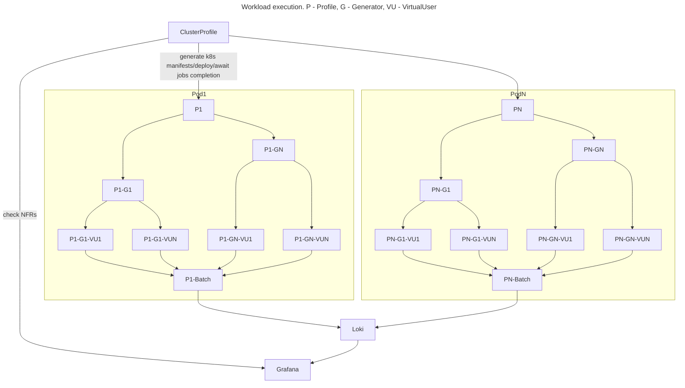
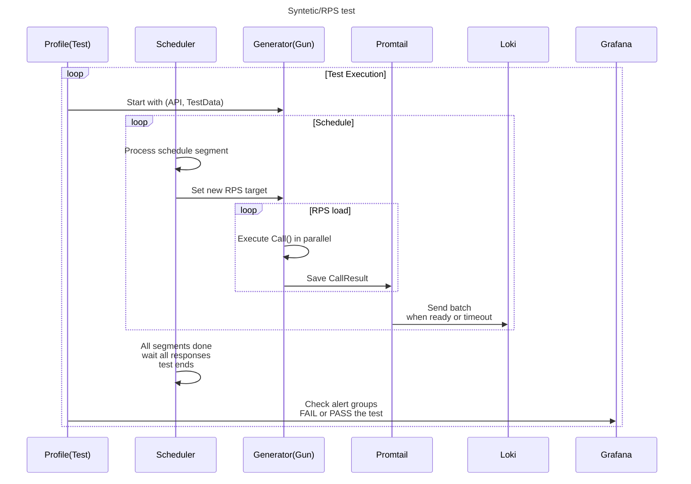
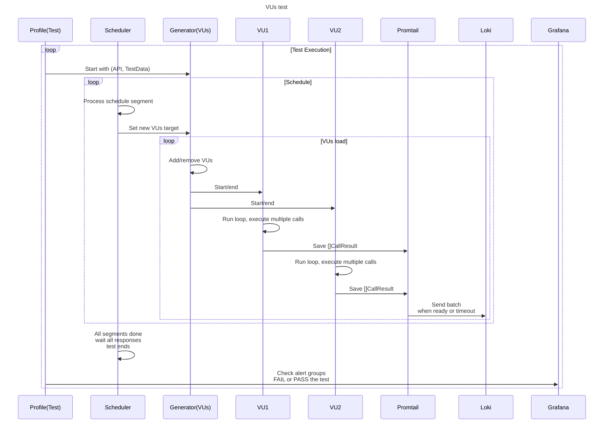
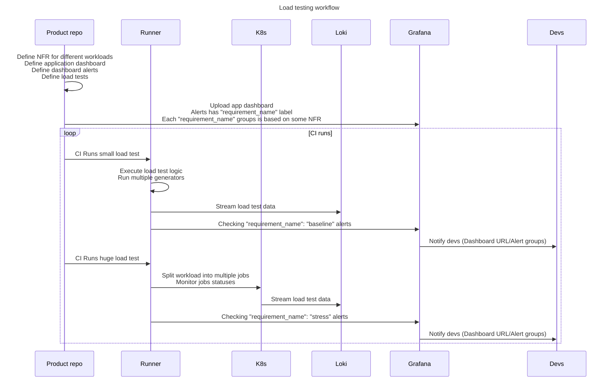

# Tutorial
## Setup
Let's create our first load test
```bash
make start
```
Insert `GRAFANA_TOKEN` created in previous command
```bash
export LOKI_URL=http://localhost:3030/loki/api/v1/push
export GRAFANA_URL=http://localhost:3000
export GRAFANA_TOKEN=...
export DATA_SOURCE_NAME=Loki
export DASHBOARD_FOLDER=LoadTests
make dashboard
```
## Overview
General idea is to be able to compose load tests programmatically by combining different `Generators`

- `Generator` is an entity that can execute some workload using some `Gun` or `VU` definition, each `Generator` may have only one `Gun` or `VU` implementation used

- `Gun` can be an implementation of single or multiple sequential requests workload for stateless protocols

- `VU` is a stateful implementation that's more suitable for stateful protocols or when your client have some logic/simulating real users

- Each `Generator` have a `Schedule` that control workload params throughout the test (increase/decrease RPS or VUs)

- `Generators` can be combined to run multiple workload units in parallel or sequentially

- `Profiles` are wrappers that allow you to run multiple generators with different `Schedules` and wait for all of them to finish

- `ClusterProfiles` are high-level wrappers that create multiple profile parts and scale your test in `k8s`

- `VU` implementations can also include sequential and parallel requests to simulate users behaviour

- `AlertChecker` can be used in tests to check if any specific alerts with label and dashboardUUID was triggered and update test status

Example cluster execution diagram:


For now, only `one node` mode is available, `k8s` scaling is planned.

Example `Syntetic/RPS` test diagram:



Example `VUs` test diagram:



Load workflow testing diagram:

## Examples

## RPS test
- [test](https://github.com/smartcontractkit/wasp/blob/master/examples/simple_rps/main.go#L9)
- [gun](https://github.com/smartcontractkit/wasp/blob/master/examples/simple_rps/gun.go#L23)
```
cd examples/simple_rps
go run .
```
Open [dashboard](http://localhost:3000/d/wasp/wasp-load-generator?orgId=1&refresh=5s&var-go_test_name=generator_healthcheck&var-gen_name=generator_healthcheck&var-branch=generator_healthcheck&var-commit=generator_healthcheck&from=now-5m&to=now)

`Gun` must implement this [interface](https://github.com/smartcontractkit/wasp/blob/master/wasp.go#L39)

## VUs test
- [test](https://github.com/smartcontractkit/wasp/blob/master/examples/simple_vu/main.go#L10)
- [vu](https://github.com/smartcontractkit/wasp/blob/master/examples/simple_vu/vu.go#L19)
```
cd examples/simple_vu
go run .
```
Open [dashboard](http://localhost:3000/d/wasp/wasp-load-generator?orgId=1&refresh=5s&var-go_test_name=generator_healthcheck&var-gen_name=generator_healthcheck&var-branch=generator_healthcheck&var-commit=generator_healthcheck&from=now-5m&to=now)

`VirtualUser` must implement this [interface](https://github.com/smartcontractkit/wasp/blob/master/wasp.go#L47)

## Usage in tests
- [test](https://github.com/smartcontractkit/wasp/blob/master/examples/go_test/main_test.go#L10)
- [gun](https://github.com/smartcontractkit/wasp/blob/master/examples/go_test/gun.go#L23)
```
cd examples/go_test
go test -v -count 1 .
```
Open [dashboard](http://localhost:3000/d/wasp/wasp-load-generator?orgId=1&refresh=5s&var-go_test_name=TestGenUsageWithTests&var-gen_name=generator_healthcheck&var-branch=generator_healthcheck&var-commit=generator_healthcheck&from=now-5m&to=now)

## Profile test (group multiple generators in parallel)
- [test](https://github.com/smartcontractkit/wasp/blob/master/examples/profiles/main_test.go#L11)
- [gun](https://github.com/smartcontractkit/wasp/blob/master/examples/profiles/gun.go#L23)
- [vu](https://github.com/smartcontractkit/wasp/blob/master/examples/profiles/vu.go#L19)
```
cd examples/profiles
go test -v -count 1 .
```
Open [dashboard](http://localhost:3000/d/wasp/wasp-load-generator?orgId=1&refresh=5s&var-go_test_name=TestProfile&var-gen_name=second%20API&var-gen_name=third%20API&var-gen_name=first%20API&var-branch=generator_healthcheck&var-commit=generator_healthcheck&from=now-5m&to=now)

## Scenario with simulating users behaviour
- [test](https://github.com/smartcontractkit/wasp/blob/master/examples/go_test/main_test.go#L15)
- [gun](https://github.com/smartcontractkit/wasp/blob/master/examples/go_test/gun.go#L23)
```
cd examples/scenario
go test -v -count 1 .
```
Open [dashboard](http://localhost:3000/d/wasp/wasp-load-generator?orgId=1&refresh=5s&var-go_test_name=TestScenario&var-gen_name=Two%20sequential%20calls%20scenario&var-branch=generator_healthcheck&var-commit=generator_healthcheck&from=now-5m&to=now)

## Defining NFRs and checking alerts
You can define different non-functional requirements groups
In this example we have 2 groups:
- `baseline` - checking both 99th latencies per `Generator` and errors
- `stress` - checking only errors

`WaspAlerts` can be defined on default `Generators` metrics, for each alert additional row is generated

`CustomAlerts` can be defined as [timeseries.Alert](https://pkg.go.dev/github.com/K-Phoen/grabana@v0.21.18/timeseries#Alert) but timeseries won't be included, though `AlertChecker` will check them

Run 2 tests, change mock latency/status codes to see how it works

Alert definitions usually defined with your `dashboard` and then constantly updated on each Git commit by your CI

After each run `AlertChecker` will fail the test if any alert from selected group was raised
- [definitions](https://github.com/smartcontractkit/wasp/blob/master/examples/alerts/main_test.go#L37)
- [wasp alerts](https://github.com/smartcontractkit/wasp/blob/master/examples/alerts/main_test.go#L73)
- [custom alerts](https://github.com/smartcontractkit/wasp/blob/master/examples/alerts/main_test.go#L82)
- [baseline NFR group test](https://github.com/smartcontractkit/wasp/blob/master/examples/alerts/main_test.go#L115)
- [stress NFR group test](https://github.com/smartcontractkit/wasp/blob/master/examples/alerts/main_test.go#L143)
```
cd examples/alerts
go test -v -count 1 -run TestBaselineRequirements
go test -v -count 1 -run TestStressRequirements
```
Open [alert groups](http://localhost:3000/alerting/groups)

Check [dashboard](http://localhost:3000/d/wasp/wasp-load-generator?orgId=1&refresh=5s&var-go_test_name=All&var-gen_name=All&var-branch=generator_healthcheck&var-commit=generator_healthcheck&from=now-5m&to=now), you can see per alert timeseries in the bottom
